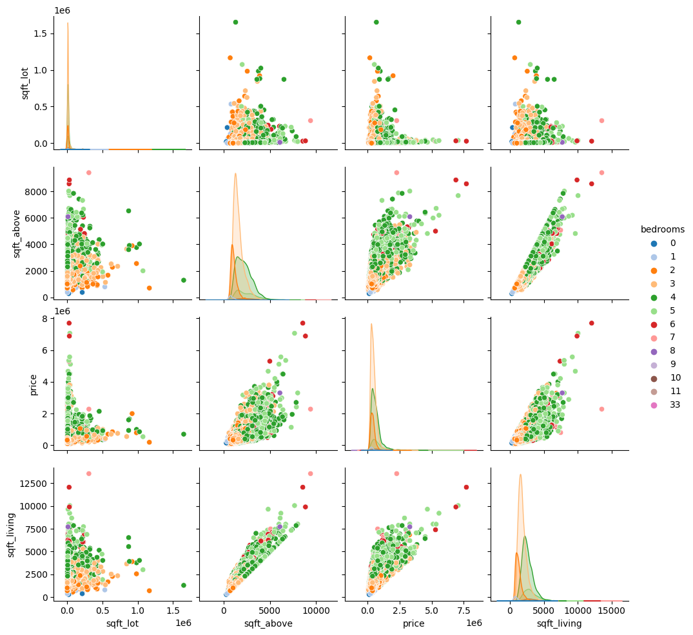
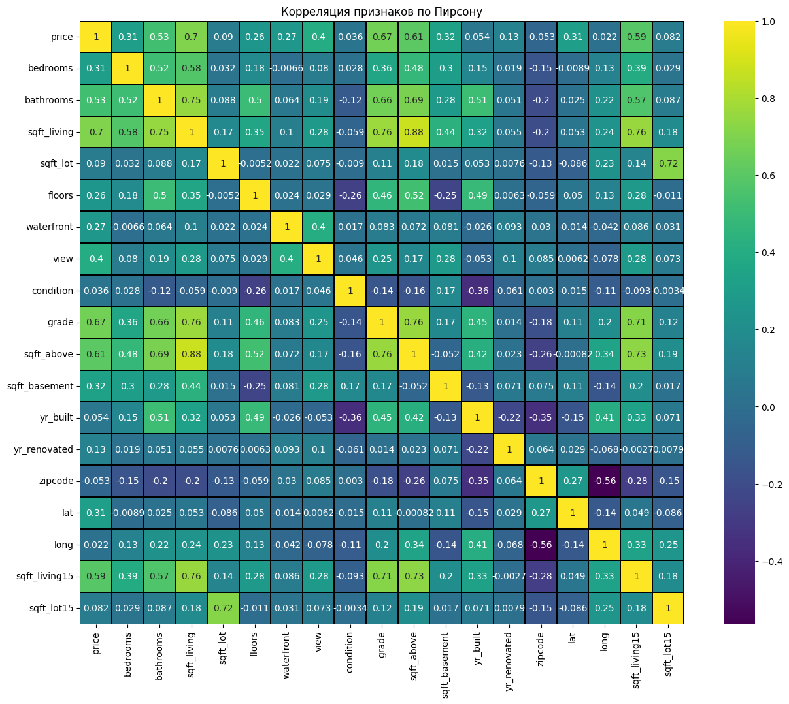
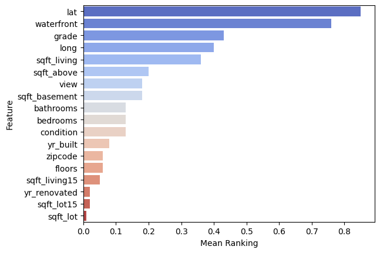

# Метод случайного леса
Всем ку, сегодня мы изучим еще один небольшой алгоритм машинного обучения, который называется Метод случайного леса. 
Как всегда, перед тем как применить его, нам нужно в очередной раз обработать информацию, и представить ее в более понятном и удобном виде

## Датасет

наш датасет представляет собой информацию о ценах продажи домов в округе штата Вашингтона, Кинг Каунти. Давайте посмотрим на этот датасет поближе


```python
#Импорт библиотек
import pandas as pd
import numpy as np
import matplotlib.pyplot as plt
import seaborn as sns
from sklearn.feature_selection import RFE, f_regression
from sklearn.linear_model import (LinearRegression, Ridge, Lasso)
from sklearn.preprocessing import MinMaxScaler
from sklearn.ensemble import RandomForestRegressor
```


```python
db=pd.read_csv('kc_house_data.csv')
db.head()
```


<div>
<style scoped>
    .dataframe tbody tr th:only-of-type {
        vertical-align: middle;
    }

    .dataframe tbody tr th {
        vertical-align: top;
    }

    .dataframe thead th {
        text-align: right;
    }
</style>
<table border="1" class="dataframe">
  <thead>
    <tr style="text-align: right;">
      <th></th>
      <th>id</th>
      <th>date</th>
      <th>price</th>
      <th>bedrooms</th>
      <th>bathrooms</th>
      <th>sqft_living</th>
      <th>sqft_lot</th>
      <th>floors</th>
      <th>waterfront</th>
      <th>view</th>
      <th>...</th>
      <th>grade</th>
      <th>sqft_above</th>
      <th>sqft_basement</th>
      <th>yr_built</th>
      <th>yr_renovated</th>
      <th>zipcode</th>
      <th>lat</th>
      <th>long</th>
      <th>sqft_living15</th>
      <th>sqft_lot15</th>
    </tr>
  </thead>
  <tbody>
    <tr>
      <th>0</th>
      <td>7129300520</td>
      <td>20141013T000000</td>
      <td>221900.0</td>
      <td>3</td>
      <td>1.00</td>
      <td>1180</td>
      <td>5650</td>
      <td>1.0</td>
      <td>0</td>
      <td>0</td>
      <td>...</td>
      <td>7</td>
      <td>1180</td>
      <td>0</td>
      <td>1955</td>
      <td>0</td>
      <td>98178</td>
      <td>47.5112</td>
      <td>-122.257</td>
      <td>1340</td>
      <td>5650</td>
    </tr>
    <tr>
      <th>1</th>
      <td>6414100192</td>
      <td>20141209T000000</td>
      <td>538000.0</td>
      <td>3</td>
      <td>2.25</td>
      <td>2570</td>
      <td>7242</td>
      <td>2.0</td>
      <td>0</td>
      <td>0</td>
      <td>...</td>
      <td>7</td>
      <td>2170</td>
      <td>400</td>
      <td>1951</td>
      <td>1991</td>
      <td>98125</td>
      <td>47.7210</td>
      <td>-122.319</td>
      <td>1690</td>
      <td>7639</td>
    </tr>
    <tr>
      <th>2</th>
      <td>5631500400</td>
      <td>20150225T000000</td>
      <td>180000.0</td>
      <td>2</td>
      <td>1.00</td>
      <td>770</td>
      <td>10000</td>
      <td>1.0</td>
      <td>0</td>
      <td>0</td>
      <td>...</td>
      <td>6</td>
      <td>770</td>
      <td>0</td>
      <td>1933</td>
      <td>0</td>
      <td>98028</td>
      <td>47.7379</td>
      <td>-122.233</td>
      <td>2720</td>
      <td>8062</td>
    </tr>
    <tr>
      <th>3</th>
      <td>2487200875</td>
      <td>20141209T000000</td>
      <td>604000.0</td>
      <td>4</td>
      <td>3.00</td>
      <td>1960</td>
      <td>5000</td>
      <td>1.0</td>
      <td>0</td>
      <td>0</td>
      <td>...</td>
      <td>7</td>
      <td>1050</td>
      <td>910</td>
      <td>1965</td>
      <td>0</td>
      <td>98136</td>
      <td>47.5208</td>
      <td>-122.393</td>
      <td>1360</td>
      <td>5000</td>
    </tr>
    <tr>
      <th>4</th>
      <td>1954400510</td>
      <td>20150218T000000</td>
      <td>510000.0</td>
      <td>3</td>
      <td>2.00</td>
      <td>1680</td>
      <td>8080</td>
      <td>1.0</td>
      <td>0</td>
      <td>0</td>
      <td>...</td>
      <td>8</td>
      <td>1680</td>
      <td>0</td>
      <td>1987</td>
      <td>0</td>
      <td>98074</td>
      <td>47.6168</td>
      <td>-122.045</td>
      <td>1800</td>
      <td>7503</td>
    </tr>
  </tbody>
</table>
<p>5 rows × 21 columns</p>
</div>


```python
#Найдем missing дату
print(db.isnull().any())
print(db.dtypes)
```

    id               False
    date             False
    price            False
    bedrooms         False
    bathrooms        False
    sqft_living      False
    sqft_lot         False
    floors           False
    waterfront       False
    view             False
    condition        False
    grade            False
    sqft_above       False
    sqft_basement    False
    yr_built         False
    yr_renovated     False
    zipcode          False
    lat              False
    long             False
    sqft_living15    False
    sqft_lot15       False
    dtype: bool
    id                 int64
    date              object
    price            float64
    bedrooms           int64
    bathrooms        float64
    sqft_living        int64
    sqft_lot           int64
    floors           float64
    waterfront         int64
    view               int64
    condition          int64
    grade              int64
    sqft_above         int64
    sqft_basement      int64
    yr_built           int64
    yr_renovated       int64
    zipcode            int64
    lat              float64
    long             float64
    sqft_living15      int64
    sqft_lot15         int64
    dtype: object
    

## УРА!
Пропущенных значений тут нет, и все столбцы сразу же имеют числовой формат (кроме столбца даты, но это легко меняется). Давайте вообще уберем отсюда дату и числовой идентификатор, они нам не нужны тут вообще.


```python
db.drop(labels=['date','id'], axis=1, inplace=True)
```


```python
#Теперь визуализируем данные попарно, например.
sns.pairplot(db[['sqft_lot','sqft_above','price','sqft_living','bedrooms']], hue='bedrooms', palette='tab20')
```


    <seaborn.axisgrid.PairGrid at 0x273192fbd60>


    

    


Как видно, есть прям очевидные линейные зависимости некоторых параметров. 


```python
str_list = [] # empty list to contain columns with strings (words)
for colname, colvalue in db.items():
    print(f"Столбец {colname} имеет вид {type(colvalue[1])}. Пример: {colvalue[1]}")
#Как видно, все имеют числовой формат, но некоторые int, а некоторые float. To build a heatmap, we should make all columns into float
f, ax = plt.subplots(figsize=(16, 12))
plt.title('Корреляция признаков по Пирсону')
sns.heatmap(db.astype(float).corr(),linewidths=0.25,vmax=1.0, square=True, cmap="viridis", linecolor='k', annot=True )
```

    Столбец price имеет вид <class 'numpy.float64'>. Пример: 538000.0
    Столбец bedrooms имеет вид <class 'numpy.int64'>. Пример: 3
    Столбец bathrooms имеет вид <class 'numpy.float64'>. Пример: 2.25
    Столбец sqft_living имеет вид <class 'numpy.int64'>. Пример: 2570
    Столбец sqft_lot имеет вид <class 'numpy.int64'>. Пример: 7242
    Столбец floors имеет вид <class 'numpy.float64'>. Пример: 2.0
    Столбец waterfront имеет вид <class 'numpy.int64'>. Пример: 0
    Столбец view имеет вид <class 'numpy.int64'>. Пример: 0
    Столбец condition имеет вид <class 'numpy.int64'>. Пример: 3
    Столбец grade имеет вид <class 'numpy.int64'>. Пример: 7
    Столбец sqft_above имеет вид <class 'numpy.int64'>. Пример: 2170
    Столбец sqft_basement имеет вид <class 'numpy.int64'>. Пример: 400
    Столбец yr_built имеет вид <class 'numpy.int64'>. Пример: 1951
    Столбец yr_renovated имеет вид <class 'numpy.int64'>. Пример: 1991
    Столбец zipcode имеет вид <class 'numpy.int64'>. Пример: 98125
    Столбец lat имеет вид <class 'numpy.float64'>. Пример: 47.721
    Столбец long имеет вид <class 'numpy.float64'>. Пример: -122.319
    Столбец sqft_living15 имеет вид <class 'numpy.int64'>. Пример: 1690
    Столбец sqft_lot15 имеет вид <class 'numpy.int64'>. Пример: 7639
    


    <AxesSubplot: title={'center': 'Корреляция признаков по Пирсону'}>


    

    


Какие можно сделать выводы, просто смотря на эту тепловую карту?

Можно сразу сказать, что существует зависимость, к примеру, между:
* Кол-вом этажей и кол-вом ванных комнат (floar and bathrooms)
* 


Также пока это писал, узнал что на хабре есть какая-то небольшая инфа по этому же датасету, вот ссылка
https://habr.com/ru/post/505516/


```python
Y=db.price.values
X=db
X.drop(['price'],axis=1,inplace=True)
X=X.values
colnames=db.columns
print(X)
```

    [[ 3.00000e+00  1.00000e+00  1.18000e+03 ... -1.22257e+02  1.34000e+03
       5.65000e+03]
     [ 3.00000e+00  2.25000e+00  2.57000e+03 ... -1.22319e+02  1.69000e+03
       7.63900e+03]
     [ 2.00000e+00  1.00000e+00  7.70000e+02 ... -1.22233e+02  2.72000e+03
       8.06200e+03]
     ...
     [ 2.00000e+00  7.50000e-01  1.02000e+03 ... -1.22299e+02  1.02000e+03
       2.00700e+03]
     [ 3.00000e+00  2.50000e+00  1.60000e+03 ... -1.22069e+02  1.41000e+03
       1.28700e+03]
     [ 2.00000e+00  7.50000e-01  1.02000e+03 ... -1.22299e+02  1.02000e+03
       1.35700e+03]]
    

Далее мы будем использовать для оценки несколько методов для тренировки машинного обучения. Для этого мы воспользуемся также словарем ranging, со своей функцией, которая будет подсчитывать рейтинг различных методов.
Метод был придуман изначально Nicolai Meinshausen и Peter Buhlmann в работе http://stat.ethz.ch/~nicolai/stability.pdf. Если хотите, можете прочитать на досуге вечером, но понимать вы будете пару недель 
то всё.


```python
ranks={}
def ranking(ranks,names,order=1):
    minmax=MinMaxScaler()
    ranks=minmax.fit_transform(order*np.array([ranks]).T).T[0]
    ranks=map(lambda x:round(x,2),ranks)
    return dict(zip(names,ranks))
```

Стоит отметить, что мы сейчас будем делать. Существует метод по ранжированию объектов. Recursive Feature Elimination, Рекурсивное исключение объекта, или же просто RFE метод, находит в модели регрессии (в примере ниже - в линейной регрессии) наилучший или наихудший признак, и исключает его. Затем он повторят этот процесс до тех пор, пока не будут использованы все объекты в наборе данных (ну или до определенного пользователем предела, я здесь его не указывал, поэтому он пройдется по всем) 


```python
lr = LinearRegression()
lr.fit(X,Y)
#stop the search when only the last feature is left
rfe = RFE(lr, n_features_to_select=1, verbose =3 )
rfe.fit(X,Y)
ranks["RFE"] = ranking(list(map(float, rfe.ranking_)), colnames, order=-1)
```

    Fitting estimator with 18 features.
    Fitting estimator with 17 features.
    Fitting estimator with 16 features.
    Fitting estimator with 15 features.
    Fitting estimator with 14 features.
    Fitting estimator with 13 features.
    Fitting estimator with 12 features.
    Fitting estimator with 11 features.
    Fitting estimator with 10 features.
    Fitting estimator with 9 features.
    Fitting estimator with 8 features.
    Fitting estimator with 7 features.
    Fitting estimator with 6 features.
    Fitting estimator with 5 features.
    Fitting estimator with 4 features.
    Fitting estimator with 3 features.
    Fitting estimator with 2 features.
    


```python
print(f"Выпишем последовательность номеров признаков, которые больше всего влияют на поведение линейной регрессии.\n{rfe.ranking_}")
```

    Выпишем последовательность номеров признаков, которые больше всего влияют на поведение линейной регрессии.
    [10 11  1 18 13  4  8  9  7  2  3 12 16 14  5  6 15 17]
    

Теперь давайте применим 3 различные линейные модели (линейную регрессию, регрессию лассо и регрессию гребня) и рассмотрим, как объекты выбираются и расставляются приоритеты с помощью этих моделей. Чтобы достичь этого, я буду использовать реализацию sklearn этих моделей и, в частности, атрибут .coef для возврата оценочных коэффициентов для каждого объекта в линейной модели.


```python
# Using Linear Regression
lr = LinearRegression()
lr.fit(X,Y)
ranks["LinReg"] = ranking(np.abs(lr.coef_), colnames)

# Using Ridge 
ridge = Ridge(alpha = 7)
ridge.fit(X,Y)
ranks['Ridge'] = ranking(np.abs(ridge.coef_), colnames)

# Using Lasso
lasso = Lasso(alpha=.05)
lasso.fit(X, Y)
ranks["Lasso"] = ranking(np.abs(lasso.coef_), colnames)
```

    c:\Python310\lib\site-packages\sklearn\linear_model\_coordinate_descent.py:648: ConvergenceWarning: Objective did not converge. You might want to increase the number of iterations, check the scale of the features or consider increasing regularisation. Duality gap: 3.982e+14, tolerance: 2.913e+11
      model = cd_fast.enet_coordinate_descent(
    

Модель случайного леса Sklearn также поставляется со своим собственным встроенным атрибутом ранжирования объектов, и ее удобно вызывать через "featureimportances". Это то, что мы будем использовать следующим образом:


```python
rf = RandomForestRegressor(n_jobs=-1, n_estimators=50, verbose=3)
''' 
n_estimators — число деревьев в "лесу" (по дефолту – 10)
    criterion — функция, которая измеряет качество разбиения ветки дерева (по дефолту — "mse" , так же можно выбрать "mae")
    max_features — число признаков, по которым ищется разбиение. Вы можете указать конкретное число или процент признаков, либо выбрать из доступных значений: "auto" (все признаки), "sqrt", "log2". По дефолту стоит "auto".
    max_depth — максимальная глубина дерева  (по дефолту глубина не ограничена)
    min_samples_split — минимальное количество объектов, необходимое для разделения внутреннего узла. Можно задать числом или процентом от общего числа объектов (по дефолту — 2)
    min_samples_leaf — минимальное число объектов в листе. Можно задать числом или процентом от общего числа объектов (по дефолту — 1)
    min_weight_fraction_leaf — минимальная взвешенная доля от общей суммы весов (всех входных объектов) должна быть в листе (по дефолту имеют одинаковый вес)
    max_leaf_nodes — максимальное количество листьев (по дефолту нет ограничения)
    min_impurity_split — порог для остановки наращивания дерева (по дефолту 1е-7)
    bootstrap — применять ли бустрэп для построения дерева (по дефолту True)
    oob_score — использовать ли out-of-bag объекты для оценки R^2 (по дефолту False)
    n_jobs — количество ядер для построения модели и предсказаний (по дефолту 1, если поставить -1, то будут использоваться все ядра)
    random_state — начальное значение для генерации случайных чисел (по дефолту его нет, если хотите воспроизводимые результаты, то нужно указать любое число типа int
    verbose — вывод логов по построению деревьев (по дефолту 0)
    warm_start — использует уже натренированую модель и добавляет деревьев в ансамбль (по дефолту False)
'''
rf.fit(X,Y)
ranks["RF"] = ranking(rf.feature_importances_, colnames);
```

    [Parallel(n_jobs=-1)]: Using backend ThreadingBackend with 4 concurrent workers.
    

    building tree 1 of 50
    building tree 2 of 50
    building tree 3 of 50
    building tree 4 of 50
    building tree 5 of 50
    building tree 6 of 50
    building tree 7 of 50
    building tree 8 of 50
    building tree 9 of 50
    building tree 10 of 50
    building tree 11 of 50
    building tree 12 of 50
    building tree 13 of 50
    building tree 14 of 50
    building tree 15 of 50
    building tree 16 of 50
    building tree 17 of 50
    building tree 18 of 50
    building tree 19 of 50
    building tree 20 of 50
    building tree 21 of 50
    building tree 22 of 50
    building tree 23 of 50
    building tree 24 of 50
    building tree 25 of 50
    building tree 26 of 50
    building tree 27 of 50
    building tree 28 of 50
    

    [Parallel(n_jobs=-1)]: Done  24 tasks      | elapsed:    2.0s
    

    building tree 29 of 50
    building tree 30 of 50
    building tree 31 of 50
    building tree 32 of 50
    building tree 33 of 50
    building tree 34 of 50
    building tree 35 of 50
    building tree 36 of 50
    building tree 37 of 50
    building tree 38 of 50
    building tree 39 of 50
    building tree 40 of 50
    building tree 41 of 50
    building tree 42 of 50
    building tree 43 of 50
    building tree 44 of 50
    building tree 45 of 50
    building tree 46 of 50
    building tree 47 of 50
    building tree 48 of 50
    building tree 49 of 50
    building tree 50 of 50
    

    [Parallel(n_jobs=-1)]: Done  50 out of  50 | elapsed:    4.2s finished
    


```python
r = {}
for name in colnames:
    r[name] = round(np.mean([ranks[method][name] 
                             for method in ranks.keys()]), 2)
 
methods = sorted(ranks.keys())
ranks["Mean"] = r
methods.append("Mean")
 
print("\t%s" % "\t".join(methods))
for name in colnames:
    print("%s\t%s" % (name, "\t".join(map(str, 
                         [ranks[method][name] for method in methods]))))
```

    	Lasso	LinReg	RF	RFE	Ridge	Mean
    bedrooms	0.06	0.06	0.0	0.47	0.06	0.13
    bathrooms	0.07	0.07	0.02	0.41	0.07	0.13
    sqft_living	0.0	0.0	0.82	1.0	0.0	0.36
    sqft_lot	0.0	0.0	0.04	0.0	0.0	0.01
    floors	0.01	0.01	0.0	0.29	0.01	0.06
    waterfront	0.97	0.97	0.09	0.82	0.94	0.76
    view	0.09	0.09	0.03	0.59	0.09	0.18
    condition	0.04	0.04	0.0	0.53	0.04	0.13
    grade	0.16	0.16	1.0	0.65	0.16	0.43
    sqft_above	0.0	0.0	0.07	0.94	0.0	0.2
    sqft_basement	0.0	0.0	0.01	0.88	0.0	0.18
    yr_built	0.0	0.0	0.07	0.35	0.0	0.08
    yr_renovated	0.0	0.0	0.0	0.12	0.0	0.02
    zipcode	0.0	0.0	0.04	0.24	0.0	0.06
    lat	1.0	1.0	0.51	0.76	1.0	0.85
    long	0.36	0.36	0.21	0.71	0.35	0.4
    sqft_living15	0.0	0.0	0.09	0.18	0.0	0.05
    sqft_lot15	0.0	0.0	0.04	0.06	0.0	0.02
    


```python
# Put the mean scores into a Pandas dataframe
meanplot = pd.DataFrame(list(r.items()), columns= ['Feature','Mean Ranking'])

# Sort the dataframe
meanplot = meanplot.sort_values('Mean Ranking', ascending=False)
```


```python
# Let's plot the ranking of the features
sns.barplot(x="Mean Ranking", y="Feature", data = meanplot, 
             palette='coolwarm')
```


    <AxesSubplot: xlabel='Mean Ranking', ylabel='Feature'>


    

    


Как видно, используя написанную ранее функцию ranking, она через minmaxscaling преобразовала результаты влияния величин на цену дома. Потом мы взяли среднюю величину от нескольких методов, таким образом получил среднее число, более достоверное чем каждый их этих методов по отдельности. Также такой метод позволяет нам полностью избежать переобучения, потому что у нас несколько пакетов на которых строится среднее.
